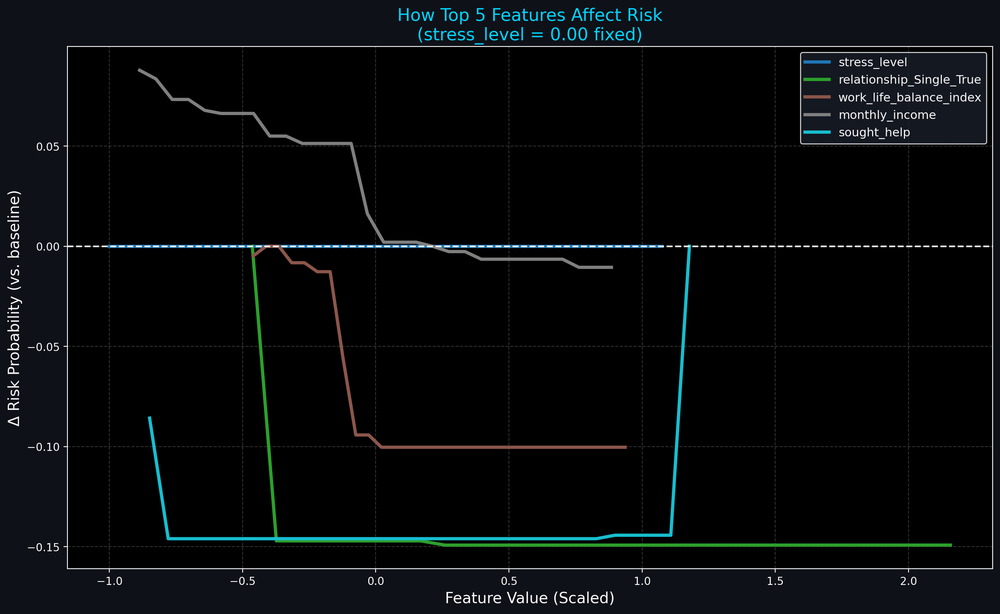
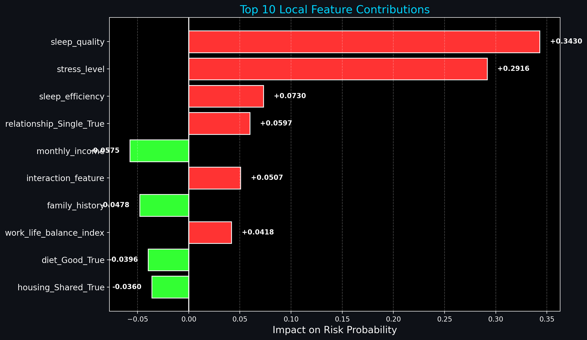
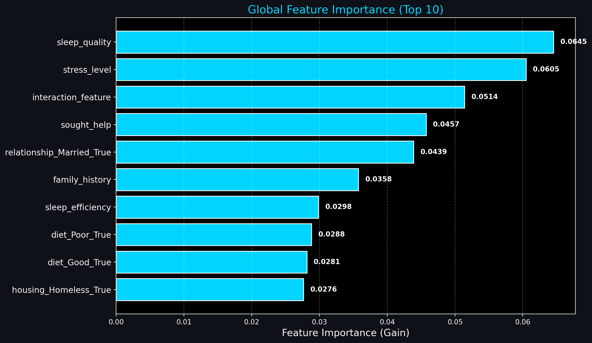
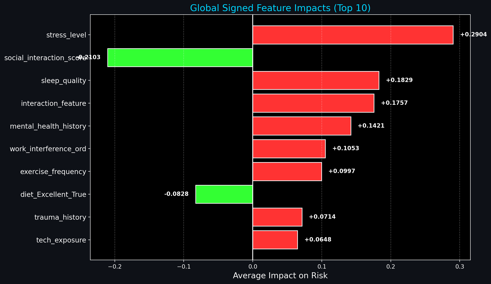

<div align="center">
  
</div>

<p align="center">
  <a href="#"></a>
  <a href="#"></a>
  <a href="#"></a>
  <a href="#"></a>
  <a href="#"></a>
</p>

---

> [!NOTE]  
> **What is MindTrack Pro?**  
> MindTrack Pro is an advanced AI-powered web application that provides a **personalized mental health risk prediction**. It uses an ensemble of robust machine learning models (XGBoost, Random Forest, Logistic Regression, and PyTorch MLPs) to evaluate risk levels, provide local feature explainability, and track mental health trends over time.

> [!IMPORTANT]  
> All data stays **local** and is saved securely for your personal tracking. Your privacy is paramount.

## ✨ Dazzling Features

*   🎯 **High-Accuracy Assessment:** Input personalized data across 5 categories (Personal, Work, Lifestyle, MH History, Social) to predict mental health risk (Low, Moderate, High).
*   🧠 **5-Model Ensemble Boost:** Aggregates predictions from Logistic Regression, Random Forest, XGBoost, and a PyTorch MLP for peak reliability.
*   🔍 **AI Explainability:** Understand *why* the AI made its prediction. See your **Top 5 Drivers** with intuitive feature impact plots.
*   📈 **Persistent Tracking:** A built-in history dashboard that maps your risk trend over time with advanced moving averages and curved forecasts.
*   💡 **Personalized Recommendations:** Actionable, customized feedback based on the exact factors driving your risk score.

---

## 📸 Visuals & Insights

<div align="center">
  <table>
    <tr>
      <td align="center"><b>Top 5 Features vs Stress</b></td>
      <td align="center"><b>Local Feature Impact</b></td>
    </tr>
    <tr>
      <td></td>
      <td></td>
    </tr>
    <tr>
      <td align="center"><b>Global Feature Importance</b></td>
      <td align="center"><b>Global Signed Importance</b></td>
    </tr>
    <tr>
      <td></td>
      <td></td>
    </tr>
  </table>
</div>

---

## 🛠️ Supercharged Tech Stack

| Domain | Tools Used |
| :--- | :--- |
| **Frontend UI** | Streamlit, HTML/CSS injects |
| **Data Processing** | Pandas, NumPy |
| **Machine Learning** | Scikit-Learn, XGBoost, PyTorch |
| **Explainability** | Custom Explainer module |
| **Visualizations** | Plotly Graph Objects, Matplotlib |

---

> [!TIP]
> **Pro Tip:** For the best performance, ensure your Python environment matches the required dependency versions!

## ⚙️ How to Run Locally

Get the guardian up and running in seconds:

1. **Clone the repository**
   ```bash
   git clone https://github.com/your-username/MindTrack.git
   cd MindTrack
   ```

2. **Install the dependencies**  
   Create a virtual environment (recommended) and install the required packages:
   ```bash
   pip install -r requirements.txt
   ```
   *(Ensure you have streamlit, pandas, scikit-learn, xgboost, and torch installed depending on your setup)*

3. **Fire up the Streamlit App**
   ```bash
   streamlit run app.py
   ```

4. **Explore & Track**
   Open your browser at `http://localhost:8501`. Navigate through the sidebar to take your first Risk Assessment!

---

<div align="center">
  
</div>
